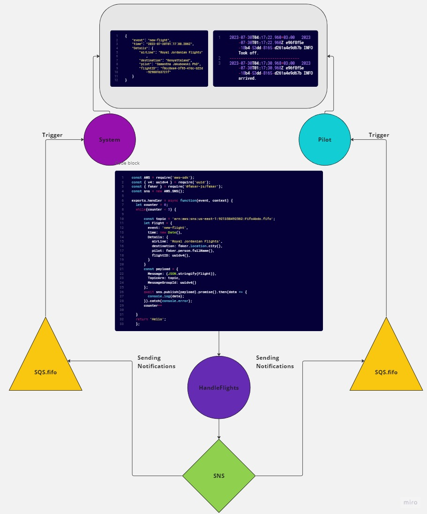
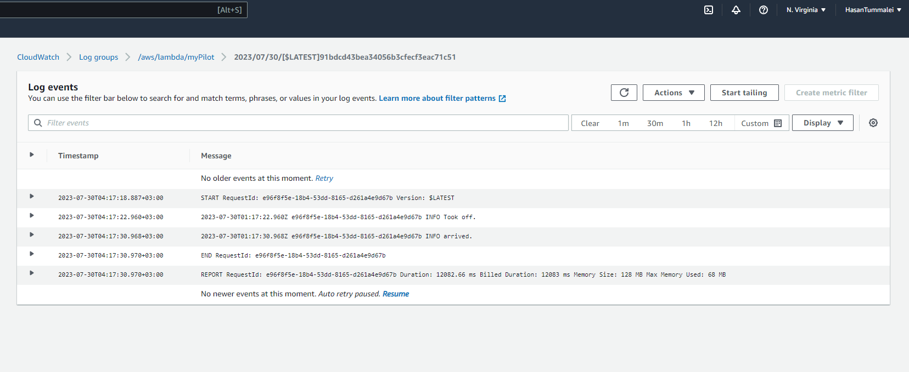
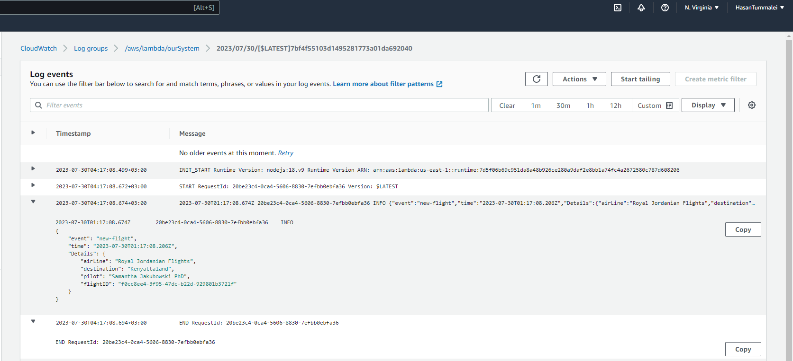

# Airline-cloud

- We are going to start by having a lambda function called handleFlights, this function includes using of the SNS package after importing the aws-sdk library, we used the ARN of the SNS topic inside the SNS instance as a payload of a message and the topic. then once the function is triggered it will send an event to the SNS system we already made on AWS console.

- Next step we created SQS of FIFO type, to collect data sent from the SNS system so the other Lambda functions of a Pilot & System could retrieve and console.log the flights updated and informations based on each flight take offs and arrivals on certain times and delay(around 8 second between each).

- For each of these two lambda functions (The Pilot & the System) has a seperate SQS FIFO. once the `handleFlights` function send a message to the SNS system as `Publish` the SNS system will update each SQS, therefore the functions linked to these SQS will be triggered and retrieve the informations from these SQS, later printing out the results or informations on the cloudWatch log service at certain times.

----

## Struggles

For this lab we couldn't use or configure some services as we wish to use, such as SQS FIFO, and publishing through CLI SNS Lambda function using the provided `LabRole` assinged to us with limited permissions and capabilties, So we had to make a new account from scratch and create new roles with extra or full permissions, our colleague Hasan created the account, then Farah,Rama & Ehab helped him making the new roles and continued working on the whole code structure to make it functioning as required.

----

## UML

----

## Console ScreenShots

